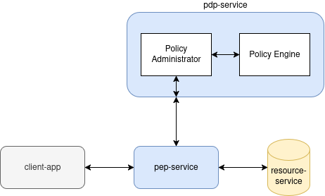

# zero-trust-zkp-poc
Proof of Concept for my bachelor's thesis. Integration of a zero knowledge proof protocol into a zero trust architecture. 

## ToDo
The following protocols should be implemented and tested:
- [x] Fiat-Shamir
- [ ] Fiat-Shamir as non-interactive through transformation
- [x] Password

Open Problems:
- [ ] Send 401 Unauthorized to client if authentication fails and handle it in the client

## Architecture


The architecture is based on the [Zero Trust Architecture](https://www.nist.gov/publications/zero-trust-architecture) from NIST. The main components are:
- **Policy Enforcement Point**: As the gateway to the system, it is responsible for enforcing the security policies. Implemented as a reverse proxy.
- **Policy Administrator**: It is responsible for managing the sessions in which the Fiat-Shamir Protocol takes place. Furthermore, it is responsible for Authentication as a whole.
- **Policy Engine**: It is responsible for evaluating the security policies, analyzing the context of a request and providing the results to the Policy Administrator. 

**Policy Administrator** and **Policy Engine** are implemented as a single service, the **Policy Decision Point**, in this Proof of Concept.
To complete the architecture, the following components are also needed:
- **Client**: The client is the user of the system. Theoretically it can be a web browser or any other application that interacts with the system. In this Proof of Concept, it itself is a service that interacts with the Policy Enforcement Point through HTTP requests.
- **Resource Server**: The resource server is the component that ultimately provides the resources to the client. It is registered to the Zero Trust Architecture and therefore protected by the Policy Enforcement Point and can only be accessed through it.

## Setup
The project is a Maven project. To run it, you need to have Java 21 and Maven installed. You can run the project with the following command:
```bash
mvn clean install
```
This will build the project and run the tests. To run the application, you can use the following command:
```bash
mvn spring-boot:run
```

